# IFTA ya! 

## Table of Contents

1. [Quick Installation for testing using Docker](#docker)
1. [Custom Installation](#installation)
1. [Structure and apps](#structure)
1. [Deploying in VPS](#deploy)
1. [Screenshots of the Frontend React App](#screenshots_frontend)
1. [Screenshots of the Flutter (Android + IOS) App](#screenshots_flutter)
1. [Useful Links](#useful_links)

<a name="docker"></a>

### Quick Installation for testing using Docker

1. Clone the repo:

   ```bash
   git clone https://github.com/Ceci-Aguilera/ifta_flask_backend_api.git
   ```

1. Install Docker and Docker Compose

1. Configure the environment variables using one of the following methods:

   i. Create an .env file inside the __config__ folder and set up the following environment variables:

   ```text
    SECRET_KEY                      (for example "someSecurityPassword")
    JWT_SECRET_KEY                  (use secrets.token_hex(12) from python secrets)
    SECURITY_PASSWORD_SALT          (for example "someSecurityPassword")
    ADMIN_EMAIL_CREDENTIAL          (email to use to create a Admin user)
    ADMIN_PASSWORD_CREDENTIAL       (the password for the Admin user)
    MAIL_SERVER                     (the server for sending emails using Flask-Mail)
    MAIL_PORT
    MAIL_PASSWORD
    MAIL_STRING_ID                  (a short random string to pass when using office 365)
    FRONTEND_APP                    (an allowed origin)
   ```

   or

   ii. Copy and modify the content of the .example.env file to the .env file:

   ```bash
   cp config/.example.env config/.env
   ```

1. Run the command:

   ```bash
   docker-compose up -d --build
   ```

1. Congratulations =) !!! the app should be running in [localhost:5000](http://localhost:5000)

<a name="installation"></a>

### Custom Installation

1. Clone the repo:

   ```bash
   git clone https://github.com/Ceci-Aguilera/ifta_flask_backend_api.git
   ```

1. Create a virtual env and Pip install dependencies:

   ```bash
   pip install -r requirements.txt
   ```

1. Open the app.py file and change the parameter of create_app to 'development' (by default it is set to production)

1. Set up postgresql database ([See Useful Links](#useful_links)). For development the default credentials are:

   ```text
       Database name: ifta_test_db
       Database user: ifta_test_user
       Database password: ifta_test_pass
       Database host: localhost
       Database port: 5432
   ```

1. Config the environment variables using one of the following methods:

   i. Create an .env file inside the __config__ folder and set up the following environment variables:

   ```text
    SECRET_KEY                      (for example "someSecurityPassword")
    JWT_SECRET_KEY                  (use secrets.token_hex(12) from python secrets)
    SECURITY_PASSWORD_SALT          (for example "someSecurityPassword")
    ADMIN_EMAIL_CREDENTIAL          (email to use to create a Admin user)
    ADMIN_PASSWORD_CREDENTIAL       (the password for the Admin user)
    FRONTEND_APP                    (An allowed origin)
    MAIL_SERVER                     (the server for sending emails using Flask-Mail)
    MAIL_PORT
    MAIL_PASSWORD
    MAIL_STRING_ID                  (a short random string to pass when using office 365)
    FRONTEND_APP                    (an allowed origin)
   ```

   or

   ii. Copy and modify the content of the .example.env file to the .env file:

   ```bash
   cp config/.example.env config/.env
   ```

1. Run the migrations

   ```bash
   flask db init
   flask db migrate
   flask db upgrade
   ```

   __NOTE:__ In case of an error regarding revision of migration, run:

   ```bash
   flask db revision --rev-id <revision_id_in_error>
   flask db migrate
   flask db upgrade
   ```

1. Run the app

   ```bash
   python app.py
   ```

   __NOTE:__ To change the initial configuration edit the files __app.py__ and __config/config.py__ files. The env variables for the __config/config.py__ files are retrieved from __config/.env__ using __decouple.config__.

1. Congratulations =) !!! the app should be running in [localhost:5050](http://localhost:5050)

<a name="structure"></a>

### Structure and Apps

#### Brief Introduction
IFTA ya! is a website that helps owner operators (Truck drivers that own their truck) to have a fast, simple, and secure way of keeping their IFTA taxes up to date. To do so, this project has 3 main apps: a Next js Frontend (the clients' administration panel), A Flask Backend API (this repo), and a Flutter app for both Android and IOS devices (that is used for the Truck Driver to input new Entries when adding Fuel or Recording Miles).

There are two kind of clients, those owner operators that have only one truck (the one that they drive), and those owner operators that have multiple trucks and drive one of them. The IFTA ya! project targets the clients of the first kind, however it offers lots of features and accommodations for the second kind clients as well.


#### Basic Workflow of the Website

- The client (owner operator) can make basic CRUD operations over the trucks and drivers. In addition, drivers can be assigned to trucks.
- Driver should use the Flutter App (that is connected to this Flask Backend API) to fill new entries (add fuel gallons or miles).
- The Flask Backend API will find the correct Tax based on the date and USA state and will calculate all the necessary information for this quarter tax report.
- The Next js Frontend should be updated with the new tax calculations


#### Folders and Files

- At the root is located a file named app.py which together with the config/config.py file determine the behavior of the Flask app, and so the .env file is located inside the config folder. Most of the weight of the configuration is actually in the init.py file inside the api folder. This init.py file initializes most of the different pieces of the app such as the Database, Flask-Secure, Flask-Admin, .... Thus, in case of wanting to change what services are included this file will probably be the one to be altered.
- The __migrations__ folder contains all files auto-generated by Flask-SQLAlchemy.
- Finally, the __api__ folder contains the main apps/folders of the project, each of them has a models.py file and a views.py file. In addition, it has the static and template folders that manage static files and html (jinja2) templates respectively.
- The __api/user_account__ folder contains all the models and views for the owner operators and driver.
- The __api/quarter_entries__ folder contains all the models and views for the calculations and report of the IFTA Taxes
- The __api/admin__ folder contains all the models and views for the administration of IFTA ya!


<a name="deploy"></a>

### Deploy to VPS using PostgreSQL, Nginx, and Gunicorn

1. Clone the repo:

   ```bash
   git clone https://github.com/Ceci-Aguilera/ifta_flask_backend_api.git
   ```

1. Install the dependencies:

   ```bash
   sudo apt-get update
   sudo apt-get install python3-pip python3-dev libpq-dev postgresql postgresql-contrib nginx
   ```

1. Set up the postgresql database ([See Useful Links](#useful_links))

1. Create an .env file and configure the environment variables

1. Create a virtual env and activate it:

   ```bash
   virtualenv myprojectenv
   source myprojectenv/bin/activate
   ```

1. Pip install the requirements:

   ```bash
   pip install -r requirements.txt
   ```

1. Pip install gunicorn:

   ```bash
   pip install gunicorn
   ```

1. Open app.py and add _host='0.0.0.0'_ to the create_app() function

1. Delete the __migrations__ folder in case it exits, and create an empty folder with the same name

1. Test configuration so far:

   ```bash
   flask db init
   flask db migrate
   flask db upgrade
   
   python app.py
   ```

1. Change the frontend domain for reset password in the api/templates/user-account/send-request-reset-password.html file (currently http://localhost:3000)

1. Create wsgi.py file:

   ```bash
   sudo vim wsgi.py
   ```

   and copy and paste this:

   ```python
   from app import app
    
   if __name__ == "__main__":
   app.run()
   ```

   and then run

   ```bash
   gunicorn --bind 0.0.0.0:5050 wsgi:app
   ```

12. Complete the setup of the website with this [link](https://www.digitalocean.com/community/tutorials/how-to-serve-flask-applications-with-gunicorn-and-nginx-on-ubuntu-20-04)

13. Set up Cors to allow the frontend to fetch and post requests ([See Useful Links](#useful_links))


<a name="screenshots_frontend"></a>

### Screenshots of Selected Pages of the Frontend NEXT JS App

#### Mobile View

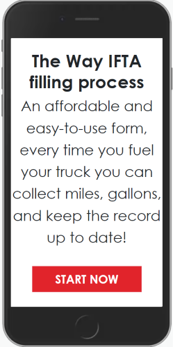 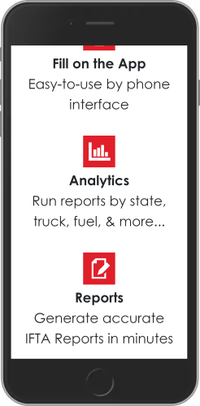 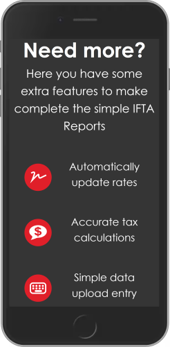

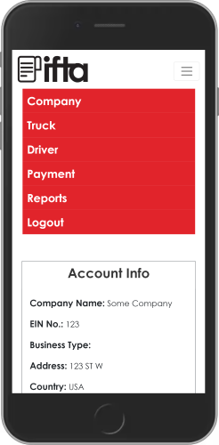 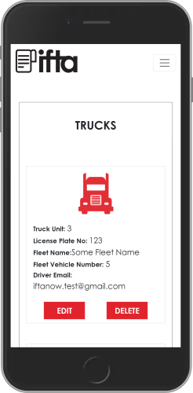 

---

#### Desktop

##### View of the Landing Page


---

##### View of the Account Information Page

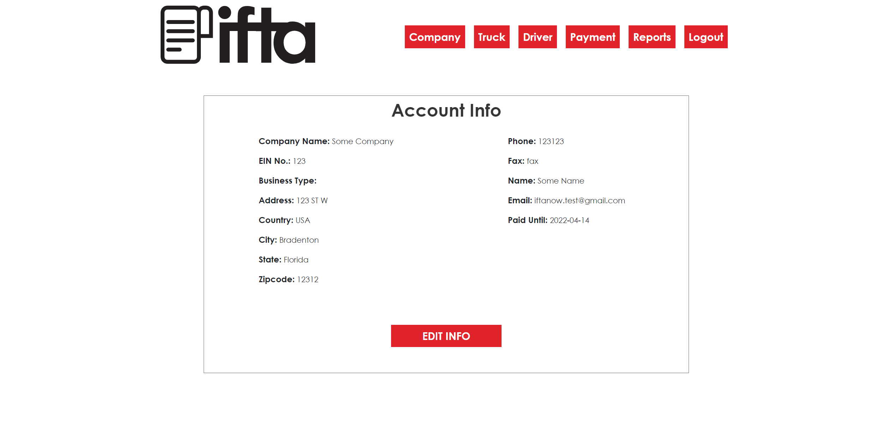

---

##### View of the Drivers Information Page when Modal is open

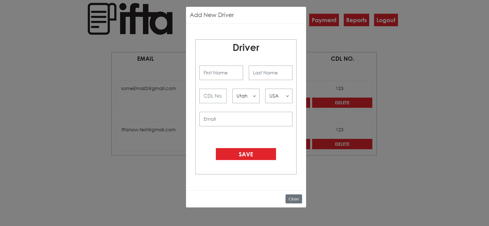

---

##### View of the Quarters Resume Page for selected Truck

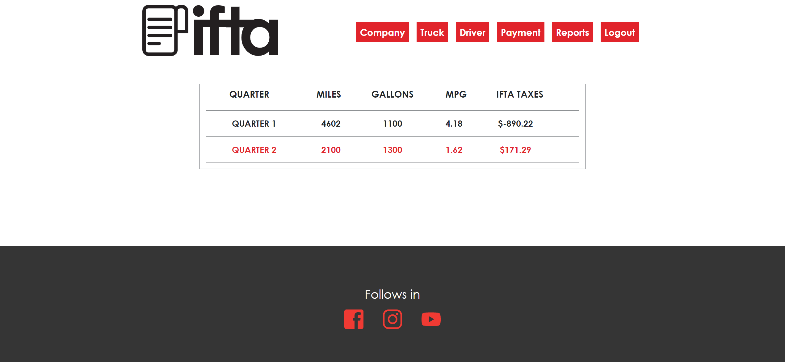

---


<a name="screenshots_flutter"></a>

### Screenshots of the Flutter (Android + IOS) App

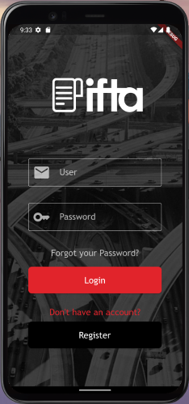 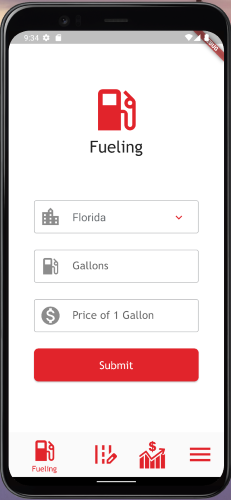 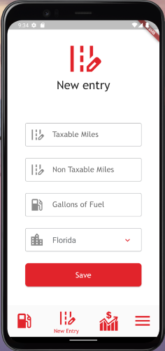

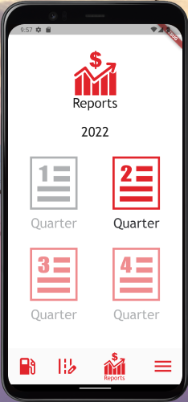 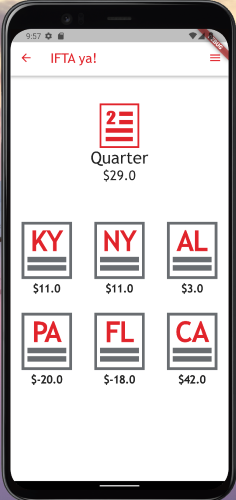 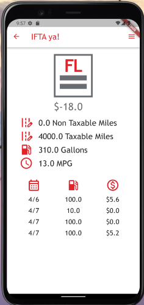
---


 <a name="useful_links"></a>

### Useful Links

#### Database (PostgreSQL and SQLAlchemy)

- Set up postgreSQL in Ubuntu (install + create database, user, and alter roles): [Link from DigitalOcean about deploying Django + Postgresql](https://www.digitalocean.com/community/tutorials/how-to-set-up-django-with-postgres-nginx-and-gunicorn-on-ubuntu-16-04)
- Create models and connecting them to the db using SQLAlchemy: [Link to Flask-SQLAlchemy official documentation](https://flask-sqlalchemy.palletsprojects.com/en/2.x/)
  - Managing Foreign Keys: One to One, One to Many, and Many to One: [Link to Flask-SQLAlchemy](https://flask-sqlalchemy.palletsprojects.com/en/2.x/models/)

#### Authentication and Admin Panel

- Flask with JWT Authentication (For calls coming from the REACT frontend): [Link to Flask-JWT-Extended official documentation](https://flask-jwt-extended.readthedocs.io/en/stable/)
- Flask Security for the Admin Panel (Using Flask-Security-Too instead of Flask Security as it is deprecated): [Link to Flask-Security-Too official documentation](https://flask-security-too.readthedocs.io/en/stable/)
  - Useful Flask-Security-Too links from Github and Stackoverflow:
    - [FS Uniqufiers is mandatory for User model, and get_user function eliminated from version 4.0](https://github.com/Flask-Middleware/flask-security/issues/85)
    - [Custom Login html and overriding other templates](https://stackoverflow.com/questions/47317722/how-do-i-embed-a-flask-security-login-form-on-my-page)
    - [Flask-Security + Flask Admin when Authenticating user Resource 1](https://stackoverflow.com/questions/31091637/how-to-secure-the-flask-admin-panel-with-flask-security)
    - [Flask-Security + Flask Admin when Authenticating user Resource 2](https://gist.github.com/skyuplam/ffb1b5f12d7ad787f6e4)

    - Flask Admin Panel:
      - [Link to Flask-Admin official documentation](https://flask-admin.readthedocs.io/en/latest/)
      - [Link to Flask-Admin github](https://github.com/flask-admin/flask-admin)
      - [Link to Custom Formatter in Stackoverflow to implement a custom field](https://stackoverflow.com/questions/37258668/flask-admin-how-to-change-formatting-of-columns-get-urls-to-display)

#### Rest Api using Restx

- [Link to Flask Restx official documentation](https://flask-restx.readthedocs.io/en/latest/)
- [Link to Flask Restx github](https://github.com/python-restx/flask-restx)

#### Managing PDFs and other files

- [Save pdf and other file types from React Frontend](https://medium.com/excited-developers/file-upload-with-react-flask-e115e6f2bf99)
- [Send pdf file to Frontend](https://docs.faculty.ai/user-guide/apis/flask_apis/flask_file_upload_download.html)
- [Render PDF file in Browser using Flask](https://artsysops.com/2021/01/02/how-to-open-a-pdf-file-on-the-browser-with-flask/)

#### Docker and Docker Compose with Flask + Postgresql

- [Dockerize Flask app with Postgresql, Guinicorn and Nginx](https://testdriven.io/blog/dockerizing-flask-with-postgres-gunicorn-and-nginx/#gunicorn)
- [Python Slim Buster error with gcc](https://github.com/watson-developer-cloud/python-sdk/issues/418)
- Using sh file in docker to init flask and run migrations: [Fix slim-buster with netcat, gcc, and g++](https://stackoverflow.com/questions/61726605/docker-entrypoint-sh-not-found)
- Why not using volumes in docker-compose for flask files: [Fix migrations folder is created and not empty error](https://stackoverflow.com/questions/69297600/why-isnt-my-dockerignore-file-ignoring-files)

#### Sending Emails with Flask-Mail

- [Flask-Mail official documentation](https://pythonhosted.org/Flask-Mail/)
- [Flask-Mail with office 365 services issue with ID Stackoverflow Fix](https://stackoverflow.com/questions/54600601/i-am-using-office-and-flask-mail)

#### Cors Headers Configuration

- [Example of simple Cors config for React js Frontend app](https://stackoverflow.com/questions/64520497/how-would-i-make-it-so-a-flask-api-can-only-be-used-with-my-reactjs-app)
