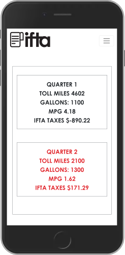

<div align="center">

 

 # IFTA ya!

        

</div>

## Table of Contents

1. [Description (What, Why, and How?)](#description)
1. [Install (Run) with Docker](#docker)
1. [Installation without Docker](#installation)
1. [Run together with the NEXT js Frontend (with and without Docker)](#connect_frontend)
1. [Folders and Files of interest](#structure)
1. [Deploying in VPS](#deploy)
1. [Screenshots of the Frontend React App](#screenshots_frontend)
1. [Screenshots of the Flutter (Android + IOS) App](#screenshots_flutter)
1. [Useful Links](#useful_links)


<a name="description"></a>
## Description

- ### What is IFTA ya! ?

 __IFTA ya!__ is a __fast__, __simple__, and __secure__ solution for calculating and reporting IFTA Taxes. It aims to help truck owners to keep their IFTA Tax Reports up to date while in the highway or office. There is no need to pass information to third-party companies as __IFTA ya!__ has all the tools needed to fast store the information, analyze it, calculate the taxes, and create accurate reports for each truck and quarter. It also allows truck owners to manage their fleets, active drivers, and trucks.

- ### What inspired IFTA ya! ?
The IFTA Tax Report of a truck have to be calculated and reported every 3 month by the truck's owner. To do so, the truck driver (which can be the truck owner or not) has to keep all the billing information about the fuel gas added to the truck as well as all the miles traveled. This information is then given to the truck owner, and then to a Tax specialist or to an expensive Tax software company. In this process, the driver can lose days searching for the bills that are often lost, and miles are not accurate reported. Therefore, the need for an alternative, in this case, __IFTA ya!__

- ### How does IFTA ya! work ?

<div align="center">

     

</div>

__IFTA ya!__  has 3 main apps: a Next js Frontend app (where owner operator's actions take place), a Flask Backend API (this repo and where most of the logic and calculations occur), and a Flutter app for both Android and IOS devices (that is used for the truck driver, possibly the owner operator, to input new Entries when adding Fuel or recording Miles).


__LINKS TO THE REPOSITORIES:__
- [NEXT js Frontend of IFTA ya!](https://github.com/Ceci-Aguilera/ifta_frontend) (The Next js Frontend)
- [Flask Backend API of IFTA ya!](https://github.com/Ceci-Aguilera/ifta_flask_backend_api) (This repo)
- The Flutter application is kept in a private repository, however screenshots of it can be found at the section [Screenshots of the Flutter (Android + IOS) App](#screenshots_flutter)


#### How do the 3 apps work together?

When an owner operator creates an account, it is possible to administrate  all the trucks, drivers, payments, and reports from the __Next js App__. The first step after registration is creating a Truck and a Driver to manage it (possibly, the owner operator itself) This actions are done via axios call to the __Flask__ Backend API. Then, the driver must download the __Flutter__ app from the Google Play Store (for Android) or the App Store (For IOS). The application should be used by drivers to register the amount and price of the Fuel Gallons added and amount of Miles driven. Then the __Flask__ Backend finds the quarter (based on the date) and the Tax for the fuel in each state, and with this information, it calculates and updates the IFTA Tax Report for each state visited by the driver in the truck, and also the overall tax information of the quarter. These changes can be visualized in the __Next js__ App by the owner of the truck. This means that if a client has 10 trucks, he can assign a Driver to each of them, and each driver then downloads the __Flutter__ app and keeps the IFTA Tax Report for the truck up to date without the client (owner of the truck) needing to do it himself.

When a driver logs in into the __Flutter__ app, the app tries to find the truck that was assigned to him by the owner operator. Therefore, each time the driver adds fuel gallons or miles, it is not needed to specify the truck that is driving, as it has been already configured. To change the current driver the owner operator can go to the __Next js__ App. Note that this method guarantees that even if a truck has multiple drivers in a quarter, its taxes can be easily deduced.

#### Notes about IFTA Taxes:

- An owner operator is a Truck driver that owns a truck.
- An owner operator can have multiple trucks and drive only one.
- A different IFTA Tax Report is presented for each truck that a client owns, that is, if a client has 10 trucks, then each truck has its own IFTA Tax Report that is independent of the others.
- Drivers do not have to present the IFTA Tax Report, as this is only a responsibility of the truck owner.
- To understand how IFTA Taxes are calculated and reported visit this [Link](https://onswitchboard.com/blog/easiest-way-to-calculate-ifta/). In reality, taxes are a bit more difficult to calculate and report as each state has its own standards and rules, however the previous link resumes the core of IFTA Taxes for a first approach.


---

<a name="docker"></a>

### Install (Run) with Docker

1. Clone the repo:

   ```bash
   git clone https://github.com/Ceci-Aguilera/ifta_flask_backend_api.git
   ```

1. Install Docker and Docker Compose

1. Configure the environment variables using one of the following methods:

   i. Create an .env file inside the __config__ folder and set up the following environment variables:

   ```text
    SECRET_KEY                      (for example "someSecurityPassword")
    JWT_SECRET_KEY                  (use secrets.token_hex(12) from python secrets)
    SECURITY_PASSWORD_SALT          (for example "someSecurityPassword")
    ADMIN_EMAIL_CREDENTIAL          (email to use to create a Admin user)
    ADMIN_PASSWORD_CREDENTIAL       (the password for the Admin user)
    MAIL_SERVER                     (the server for sending emails using Flask-Mail)
    MAIL_PORT
    MAIL_USERNAME                  
    MAIL_PASSWORD
    MAIL_STRING_ID                  (a short random string to pass when using office 365)
    STRIPE_TEST_PUBLISHABLE_KEY
    STRIPE_TEST_SECRET_KEY
    FRONTEND_APP                    (an allowed origin)
   ```

   or

   ii. Copy and modify the content of the .example.env file to the .env file:

   ```bash
   cp config/.example.env config/.env
   ```

1. Run the command:

   ```bash
   docker-compose up -d --build
   ```

1. Congratulations =) !!! the app should be running in [localhost:5000](http://localhost:5000)

<a name="installation"></a>

### Installation without Docker

1. Clone the repo:

   ```bash
   git clone https://github.com/Ceci-Aguilera/ifta_flask_backend_api.git
   ```

1. Create a virtual env and Pip install dependencies:

   ```bash
   pip install -r requirements.txt
   ```

1. Open the app.py file and change the parameter of create_app to 'development' (by default it is set to production)

1. Set up postgresql database ([See Useful Links](#useful_links)). For development the default credentials are:

   ```text
       Database name: ifta_test_db
       Database user: ifta_test_user
       Database password: ifta_test_pass
       Database host: localhost
       Database port: 5432
   ```

1. Config the environment variables using one of the following methods:

   i. Create an .env file inside the __config__ folder and set up the following environment variables:

   ```text
    SECRET_KEY                      (for example "someSecurityPassword")
    JWT_SECRET_KEY                  (use secrets.token_hex(12) from python secrets)
    SECURITY_PASSWORD_SALT          (for example "someSecurityPassword")
    ADMIN_EMAIL_CREDENTIAL          (email to use to create a Admin user)
    ADMIN_PASSWORD_CREDENTIAL       (the password for the Admin user)
    FRONTEND_APP                    (An allowed origin)
    MAIL_SERVER                     (the server for sending emails using Flask-Mail)
    MAIL_PORT
    MAIL_USERNAME
    MAIL_PASSWORD
    MAIL_STRING_ID                  (a short random string to pass when using office 365)
    STRIPE_TEST_PUBLISHABLE_KEY
    STRIPE_TEST_SECRET_KEY
    FRONTEND_APP                    (an allowed origin)
   ```

   or

   ii. Copy and modify the content of the .example.env file to the .env file:

   ```bash
   cp config/.example.env config/.env
   ```

1. Change the parameter of the function create_app() in the api/\_\_init\_\_.py file from 'testing' to 'development'

1. Run the migrations

   ```bash
   flask db init
   flask db migrate
   flask db upgrade
   ```

   __NOTE:__ In case of an error regarding revision of migration, run:

   ```bash
   flask db revision --rev-id <revision_id_in_error>
   flask db migrate
   flask db upgrade
   ```

1. Run the app

   ```bash
   python app.py
   ```

   __NOTE:__ To change the initial configuration edit the files __app.py__ and __config/config.py__ files. The env variables for the __config/config.py__ files are retrieved from __config/.env__ using __decouple.config__.

1. Congratulations =) !!! the app should be running in [localhost:5050](http://localhost:5050)


<a name="connect_frontend"></a>
### Run with the NEXT js Frontend (with and without Docker)

__Note:__ Before following these steps clone this repository. From now on the selected folder that contains the clone will be referred as __project_root__. So far, it should look like this:
   ```sh
      project_root
      └── ifta_flask_backend_api
   ```

1. Assuming that your are at the __project_root__, clone the [NEXT js Frontend repository](https://github.com/Ceci-Aguilera/ifta_frontend.git):
   ```sh
      git clone https://github.com/Ceci-Aguilera/ifta_flask_backend_api.git
   ```
   Now the __project_root__ folder should look like:
      ```sh
      project_root
      ├── ifta_flask_backend_api
      └── ifta_frontend
   ```

- #### If Using Docker and Docker Compose
   1. Copy the content of the docker-compose-connect.yml to a new file docker-compose.yml in the __project_root__. The docker-compose-connect.yml file can be found at the root of this repository and also at the root of the [NEXT js Frontend repository](https://github.com/Ceci-Aguilera/ifta_frontend.git) (Either file is fine to copy).
   1. Follow the instruction to configure the environment variables of the __NEXT js__ Frontend that can be found in the section __Install (Run) with Docker__ in the Readme.md of the [NEXT js Frontend repository](https://github.com/Ceci-Aguilera/ifta_frontend.git). The only env variable needed is the Flask Backend url, which by default should be [http://localhost:5000](http://localhost:5000).
   1. Follow the instructions on the __Install (Run) with Docker__ section of this Readme.md to configure the environment variables for this repo.
   __Note:__ Right now the __project_root__ should look like:
         ```sh
         project_root
         ├── ifta_flask_backend_api
         ├── ifta_frontend
         └── docker-compose.yml
      ```

   1. Run the command:

      ```bash
      docker-compose up --build
      ```

   1. Congratulations =) !!! the frontend app should be running in [localhost:3000](http://localhost:3000) while the backend is at [localhost:5000](http://localhost:5000)


- #### Running without Docker and Docker Compose
   1. Follow the instruction to configure the environment variables of the __NEXT js__ Frontend that can be found in the section __Installation without Docker__ in the Readme.md of the [NEXT js Frontend repository](https://github.com/Ceci-Aguilera/ifta_frontend.git). The only env variable needed is the Flask Backend url, which by default should be [http://localhost:5050](http://localhost:5050).
   1. Follow the instructions on the __Installation without Docker__ section of this Readme.md to configure the environment variables for this repo.
   1. Congratulations =) !!! the frontend app should be running in [localhost:3000](http://localhost:3000) while the backend is at [localhost:5050](http://localhost:5050)


---


<a name="structure"></a>

### Folders and Files of interest

- At the root is located a file named app.py which together with the config/config.py file determine the behavior of the Flask app, and so the .env file is located inside the config folder. Most of the weight of the configuration is actually in the init.py file inside the api folder. This init.py file initializes most of the different pieces of the app such as the Database, Flask-Secure, Flask-Admin, .... Thus, in case of wanting to change what services are included this file will probably be the one to be altered.
- The __migrations__ folder contains all files auto-generated by Flask-SQLAlchemy.
- Finally, the __api__ folder contains the main apps/folders of the project, each of them has a models.py file and a views.py file. In addition, it has the static and template folders that manage static files and html (jinja2) templates respectively.
- The __api/user_account__ folder contains all the models and views for the owner operators and driver.
- The __api/quarter_entries__ folder contains all the models and views for the calculations and report of the IFTA Taxes
- The __api/admin__ folder contains all the models and views for the administration of IFTA ya!


<a name="deploy"></a>

### Deploy to VPS using PostgreSQL, Nginx, and Gunicorn

1. Clone the repo:

   ```bash
   git clone https://github.com/Ceci-Aguilera/ifta_flask_backend_api.git
   ```

1. Install the dependencies:

   ```bash
   sudo apt-get update
   sudo apt-get install python3-pip python3-dev libpq-dev postgresql postgresql-contrib nginx
   ```

1. Set up the postgresql database ([See Useful Links](#useful_links))

1. Create an .env file and configure the environment variables

1. Create a virtual env and activate it:

   ```bash
   virtualenv myprojectenv
   source myprojectenv/bin/activate
   ```

1. Pip install the requirements:

   ```bash
   pip install -r requirements.txt
   ```

1. Pip install gunicorn:

   ```bash
   pip install gunicorn
   ```

1. Open app.py and add _host='0.0.0.0'_ to the create_app() function

1. Delete the __migrations__ folder in case it exits, and create an empty folder with the same name

1. Test configuration so far:

   ```bash
   flask db init
   flask db migrate
   flask db upgrade
   
   python app.py
   ```

1. Change the frontend domain for reset password in the api/templates/user-account/send-request-reset-password.html file (currently http://localhost:3000)

1. Create wsgi.py file:

   ```bash
   sudo vim wsgi.py
   ```

   and copy and paste this:

   ```python
   from app import app
    
   if __name__ == "__main__":
   app.run()
   ```

   and then run

   ```bash
   gunicorn --bind 0.0.0.0:5050 wsgi:app
   ```

12. Complete the setup of the website with this [link](https://www.digitalocean.com/community/tutorials/how-to-serve-flask-applications-with-gunicorn-and-nginx-on-ubuntu-20-04)

13. Set up Cors to allow the frontend to fetch and post requests ([See Useful Links](#useful_links))


<a name="screenshots_frontend"></a>

### Screenshots of Selected Pages of the Frontend NEXT JS App

#### Mobile View

<div align="center">

  

</div>

<div align="center">

  

</div>
---

#### Desktop

##### View of the Landing Page


---

##### View of the Account Information Page


---

##### View of the Drivers Information Page when Modal is open


---

##### View of the Quarters Resume Page for selected Truck


---


<a name="screenshots_flutter"></a>

### Screenshots of the Flutter (Android + IOS) App

<div align="center">

  

</div>

<div align="center">

  

</div>

---


 <a name="useful_links"></a>

### Useful Links

#### Database (PostgreSQL and SQLAlchemy)

- Set up postgreSQL in Ubuntu (install + create database, user, and alter roles): [Link from DigitalOcean about deploying Django + Postgresql](https://www.digitalocean.com/community/tutorials/how-to-set-up-django-with-postgres-nginx-and-gunicorn-on-ubuntu-16-04)
- Create models and connecting them to the db using SQLAlchemy: [Link to Flask-SQLAlchemy official documentation](https://flask-sqlalchemy.palletsprojects.com/en/2.x/)
  - Managing Foreign Keys: One to One, One to Many, and Many to One: [Link to Flask-SQLAlchemy](https://flask-sqlalchemy.palletsprojects.com/en/2.x/models/)

#### Authentication and Admin Panel

- Flask with JWT Authentication (For calls coming from the REACT frontend): [Link to Flask-JWT-Extended official documentation](https://flask-jwt-extended.readthedocs.io/en/stable/)
- Flask Security for the Admin Panel (Using Flask-Security-Too instead of Flask Security as it is deprecated): [Link to Flask-Security-Too official documentation](https://flask-security-too.readthedocs.io/en/stable/)
  - Useful Flask-Security-Too links from Github and Stackoverflow:
    - [FS Uniqufiers is mandatory for User model, and get_user function eliminated from version 4.0](https://github.com/Flask-Middleware/flask-security/issues/85)
    - [Custom Login html and overriding other templates](https://stackoverflow.com/questions/47317722/how-do-i-embed-a-flask-security-login-form-on-my-page)
    - [Flask-Security + Flask Admin when Authenticating user Resource 1](https://stackoverflow.com/questions/31091637/how-to-secure-the-flask-admin-panel-with-flask-security)
    - [Flask-Security + Flask Admin when Authenticating user Resource 2](https://gist.github.com/skyuplam/ffb1b5f12d7ad787f6e4)

    - Flask Admin Panel:
      - [Link to Flask-Admin official documentation](https://flask-admin.readthedocs.io/en/latest/)
      - [Link to Flask-Admin github](https://github.com/flask-admin/flask-admin)
      - [Link to Custom Formatter in Stackoverflow to implement a custom field](https://stackoverflow.com/questions/37258668/flask-admin-how-to-change-formatting-of-columns-get-urls-to-display)

#### Rest Api using Restx

- [Link to Flask Restx official documentation](https://flask-restx.readthedocs.io/en/latest/)
- [Link to Flask Restx github](https://github.com/python-restx/flask-restx)

#### Managing PDFs and other files

- [Save pdf and other file types from React Frontend](https://medium.com/excited-developers/file-upload-with-react-flask-e115e6f2bf99)
- [Send pdf file to Frontend](https://docs.faculty.ai/user-guide/apis/flask_apis/flask_file_upload_download.html)
- [Render PDF file in Browser using Flask](https://artsysops.com/2021/01/02/how-to-open-a-pdf-file-on-the-browser-with-flask/)

#### Docker and Docker Compose with Flask + Postgresql

- [Dockerize Flask app with Postgresql, Guinicorn and Nginx](https://testdriven.io/blog/dockerizing-flask-with-postgres-gunicorn-and-nginx/#gunicorn)
- [Python Slim Buster error with gcc](https://github.com/watson-developer-cloud/python-sdk/issues/418)
- Using sh file in docker to init flask and run migrations: [Fix slim-buster with netcat, gcc, and g++](https://stackoverflow.com/questions/61726605/docker-entrypoint-sh-not-found)
- Why not using volumes in docker-compose for flask files: [Fix migrations folder is created and not empty error](https://stackoverflow.com/questions/69297600/why-isnt-my-dockerignore-file-ignoring-files)

#### Sending Emails with Flask-Mail

- [Flask-Mail official documentation](https://pythonhosted.org/Flask-Mail/)
- [Flask-Mail with office 365 services issue with ID Stackoverflow Fix](https://stackoverflow.com/questions/54600601/i-am-using-office-and-flask-mail)

#### Cors Headers Configuration

- [Example of simple Cors config for React js Frontend app](https://stackoverflow.com/questions/64520497/how-would-i-make-it-so-a-flask-api-can-only-be-used-with-my-reactjs-app)
